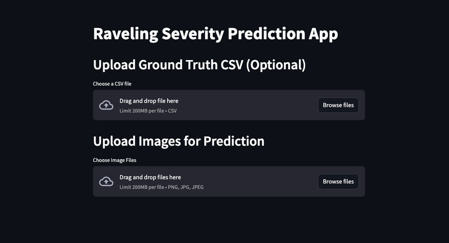
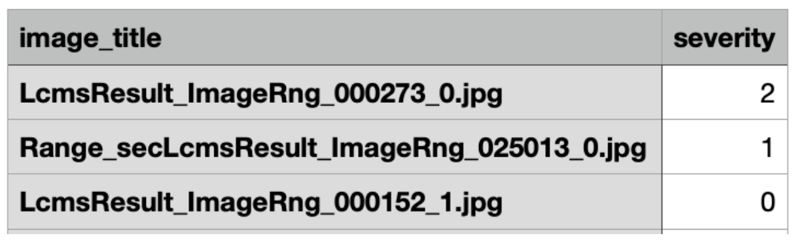
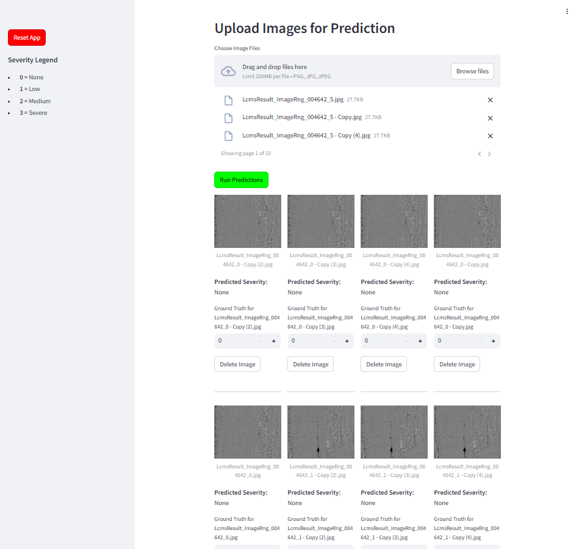
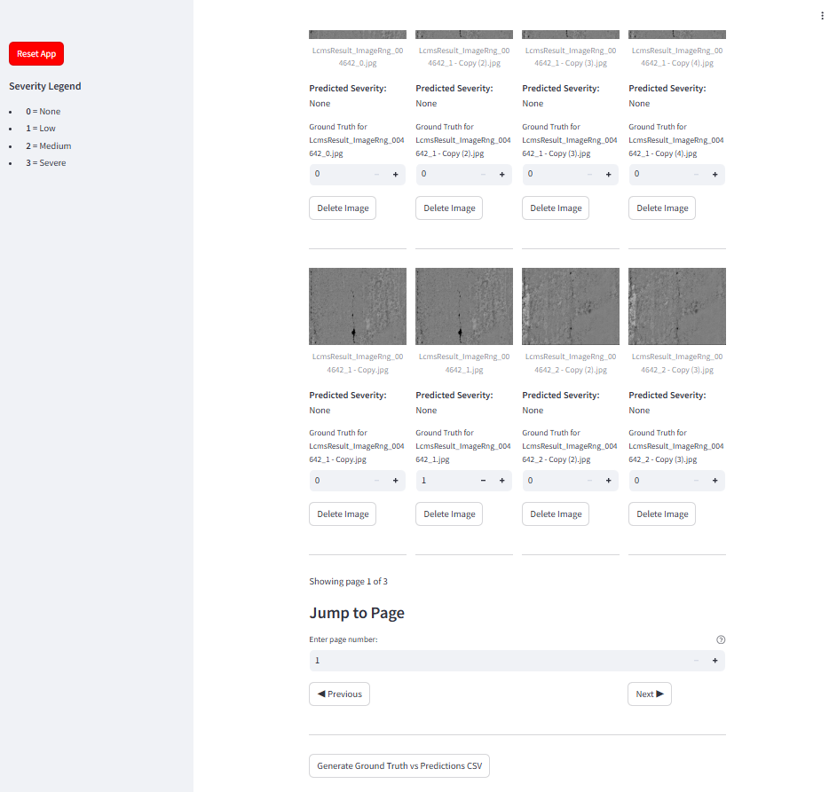

# COMPREHENSIVE TUTORIAL ON USING RAVELING MODEL WEBSITE

**Version 1.0**

## Setup Introduction

**Figure 1\.** Default website screen.

When introduced to the website, you may upload your CSV file in the format of having two columns, the first being labeled as the **image\_name**, and the second being the **severity**. Make sure the header is labeled as such, where the image\_name file has no directory besides the image itself. The severity should just be a number. Example is shown in Figure 2.

**Figure 2\.** Example shown for csv formatting.

Uploading your ground truth CSV is completely optional, as this will only be used if you want to generate a table to compare the predicted severity with your ground truth.

For uploading your images, make sure that the image names are the exact same as what is in the CSV file to have the ground truth severity levels labeled properly. You may upload as many images as you want, though our model does have issues after uploading more than \~5000 images of size 45 KB each. Some images might be corrupted and not work depending on the dimensions, as we had some tests and had an image with a lot of blank space have a range \[nan, nan\] error. If this happens to you, you would have to remove this image for testing.

After uploading the images, the raveling model will run on invokation using the button and provide you a predicted severity level for each image shown below.

Note that the app can be reset to its initial state using the reset button on the left sidebar.

**Figure 3\.** Results after uploading 375 images.

If desired, you may scroll down to the very bottom of the page and generate then download your own *Ground Truth vs Predictions CSV file*. This gives you a CSV file with three columns, the first being your **image\_title**, the second being the **predicted\_severity**, and the third being the **ground\_truth\_severity**. If you did not upload a ground truth CSV file at the start, then all values for this column will be labeled as 0\.  

## Pagination

As seen underneath your generated severity for each image, you will notice that the images are split up into pages for less clutter. We have implemented a paging system for you to go through your images in an ordered manner. However, there are some bugs to this that once you know, won’t make the website as confusing.

**Figure 4\.** Pages shown at the bottom of the screenshot.

When going to the next or previous page, you may notice that the pages may seem to be a bit delayed. This is because the website relies on user input to be updated to prevent constant running and more delays. Due to this, the website is one update behind. This means once you run the model and hit the next page button, followed by the previous page button, it will do nothing at first then go to the next page. This means that if you were to then hit the next or previous button afterwards, it will go to the previous page. This shows how the website is one update behind.

This also applies to jumping to a certain page. Just to clarify, images will *always* stay on the page that they were set at. When inserting a number to jump to, you may have to enter it twice. This is so the website can catch up to the first update you did, as explained before. If this does not work, then hit the next or previous button, and the website will update and jump to your desired page. This does seem a bit hectic, but after much bug-fixing, we could not figure out how to solve the issue without redoing the website.  

## **Shortened Notes**

Here are the shortened notes of the explanation above if desired to look at. It may help you more, it may help as much as what was explained above, but please read all the information above and not just the information below as it could get confusing.

How to use with images and their types

* Make sure that the image names are the exact same as the CSV file  
  * This includes removing the directory in the CSV files so the image names can match exactly to each row  
* Some images might not work if the image isn’t fully taken (if there is some black space for the edge of a road for example)  
  * This could be a problem, but also could just be a problem with the image  
  * Example shown above for the range \[nan, nan\] error

CSV files and expected structure

* Like said before, CSV files need to have no directories  
* There NEEDS to be a row header with the titles “image\_title” for the image column and “severity” for the severity column

 Max \# of images before app breaks

* App completely breaks with 8000+ images, and barely works with 5220 images  
  * Took 30 mins to run 8000+ images with no result, and a bit of a glitch with 5220 images  
* Thus estimated \~5000 images before the app will break

Implement some sort of stress test

* Implemented page system/jumping (somewhat-stress tests / glitches below)  
  * Spamming next page can be a bit glitchy with the images  
    * Rapidly spamming will cause some freezing, but doesn’t really seem to mess with the data at all, just the appearance for a bit  
  * Website is 1 update behind  
    * What this means is that if you click next-\>next-\>previous, the website will do nothing-\>next-\>next until you click a button again which it will then go nothing-\>next-\>next-\>previous  
    * Same thing for the page jumping, where you might have to enter the page that you want to go to twice  
    * Everything still works as intended with no random image swapping, everything is there it is supposed to be, you just have to update the page sometimes

## End

Please let us know if you have any questions or concerns about the website and how to use it, we will update this document as needed.
